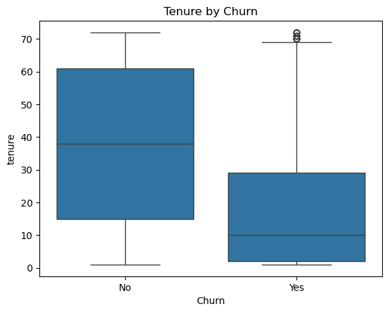
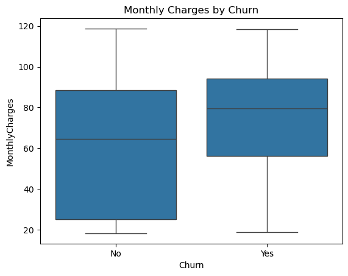
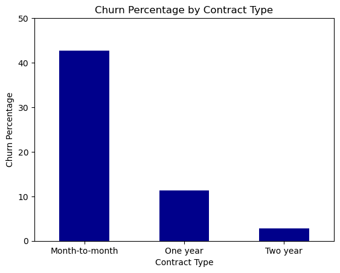
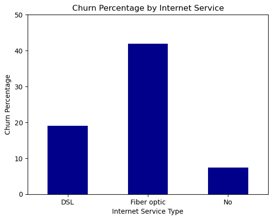
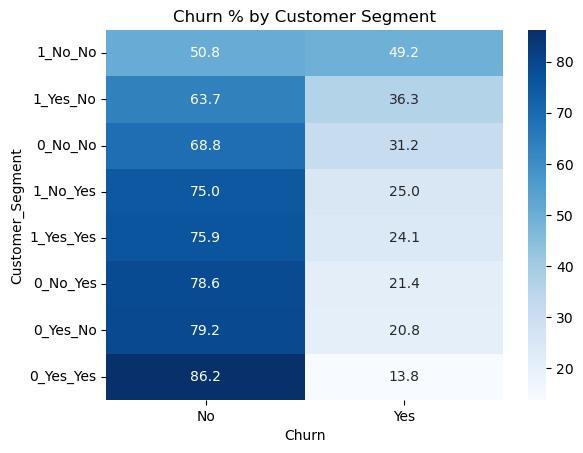

# 📊 Telco Customer Churn Analysis — Python Project

## 💡 Project Summary

This project demonstrates hands-on Python analytics to analyze telecom customer churn. It identifies high-risk customers, operational challenges, and retention opportunities, providing actionable business insights.

---

## 🔍 Project Overview

This is a Python-based project focused on analyzing customer churn in a telecom company. It demonstrates data cleaning, exploratory data analysis (EDA), visualization, and business insight generation using Python, Pandas, NumPy, Matplotlib, and Seaborn.

This is a **single-tool project (Python only)** 

---

## 🎯 Business Questions Answered

### Financial Risk

Identify customers with highest immediate revenue risk (Tenure, MonthlyCharges, TotalCharges)

### Operational Failure

Detect services or contract types causing highest churn (Contract type, InternetService, TechSupport)

### Retention Opportunity

Highlight customer segments to target for long-term retention (Demographics, service combinations)
---

## 🧰 Tools & Libraries Used

* **Python**
* **Pandas, NumPy**
* **Matplotlib, Seaborn**
* **Jupyter Notebook**

---

## 📁 Project Structure

- [1_data_cleaning_and_prep.ipynb](1_data_cleaning_and_prep.ipynb) → Data Cleaning & Preparation
- [2_financial_risk_analysis.ipynb](2_analysis_financial_risk.ipynb) Financial Risk
- [3_operational_failure_analysis.ipynb](3_analysis_operational_failure.ipynb) Operational Failure
- [4_retention_opportunity_analysis.ipynb](4_analysis_retention_targets.ipynb) Retention Opportunities

- [cleaned_telco_data.csv](cleaned_telco_data.csv) → Cleaned dataset for analysis

images/ → Charts & visualizations
- financial_risk_*.png
- operational_failure_*.png
- retention_opportunity_*.png

---

## 🧹 Data Cleaning & Preparation

* Corrected data types (e.g., `TotalCharges`)
* Handled missing values
* Created tenure-based customer segments
* Exported a cleaned dataset for analysis

---

## 📊 Key Visual Insights

### 📉 Financial Risk Analysis

### ⚙️ Operational Failure Analysis

### 🎯 Retention Opportunity Analysis

---

## 💡 Key Insights

* Customers with high monthly charges and short tenure present the highest churn risk
* Month-to-month contracts with Fiber Optic service have the highest churn
* Long-tenure customers without technical support are strong retention opportunities

---

## ✅ Why This Project Matters

* Demonstrates real-world Python data analysis workflow
* Focuses on business decision-making
* Portfolio-ready for data analyst roles

---
## 🏁 Conclusion

This project demonstrates a complete Python-based data analysis workflow, transforming raw customer data into actionable insights on churn risk, operational issues, and retention opportunities to support data-driven decisions..

