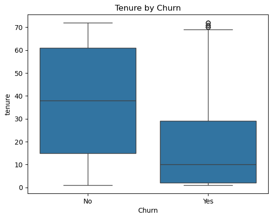
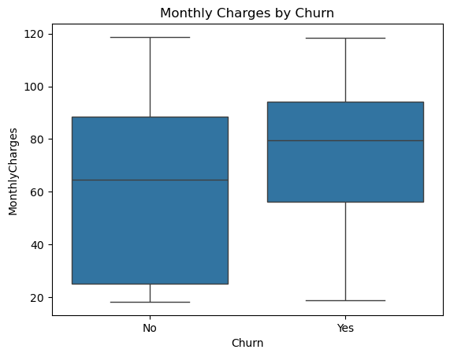
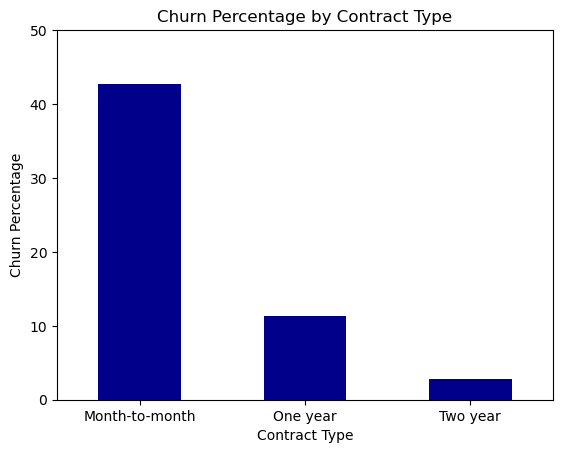
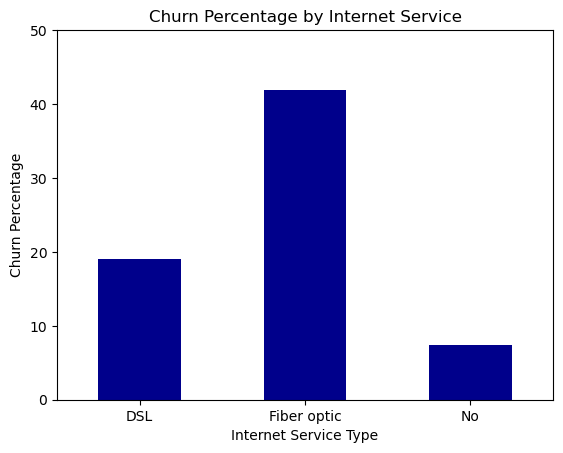
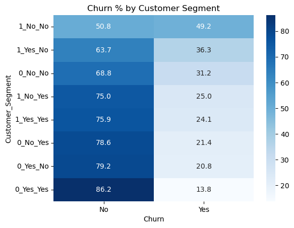

# 📊 Telco Customer Churn Analysis — Python Project

## 💡 Project Summary

This project analyzes telecom customer churn to identify high-risk customers, uncover key drivers of churn, and highlight opportunities for retention. The analysis focuses on transforming customer data into actionable insights that support revenue protection and customer retention strategies.

---

## 🔍 Project Overview

This is a Python-based project focused on analyzing customer churn in a telecom company. Customer churn is driven by a combination of pricing, contract flexibility, and service quality, with specific high-risk segments requiring targeted retention strategies.

This is a **single-tool project (Python only)** 

---

## 🎯 Business Questions Answered

### Financial Risk

Which customers contribute the highest revenue risk due to churn?

### Operational Failure

Which services and contract types are associated with the highest churn rates?

### Retention Opportunity

Which customer segments should be targeted to improve long-term retention?
---

## 🧰 Tools & Libraries Used

* **Python**
* **Pandas, NumPy**
* **Matplotlib, Seaborn**
* **Jupyter Notebook**

---

## 📁 Project Structure

- [1_data_cleaning_and_prep.ipynb](1_data_cleaning_and_prep.ipynb) → Data Cleaning & Preparation
- [2_financial_risk_analysis.ipynb](2_analysis_financial_risk.ipynb) Financial Risk
- [3_operational_failure_analysis.ipynb](3_analysis_operational_failure.ipynb) Operational Failure
- [4_retention_opportunity_analysis.ipynb](4_analysis_retention_targets.ipynb) Retention Opportunities

- [cleaned_telco_data.csv](cleaned_telco_data.csv) → Cleaned dataset for analysis

images/ → Charts & visualizations
- financial_risk_*.png
- operational_failure_*.png
- retention_opportunity_*.png

---

## 🧹 Data Cleaning & Preparation

* Cleaned and standardized customer data (handled missing values and incorrect data types)
* Converted key variables (e.g., TotalCharges) for accurate analysis
*  Created tenure-based customer segments to enable lifecycle analysis
*  Prepared a clean dataset for consistent and reproducible analysis
  
---

## 📊 Key Visual Insights

### 📉 Financial Risk Analysis

### ⚙️ Operational Failure Analysis

### 🎯 Retention Opportunity Analysis

---

## 💡 Key Insights

* dentified that customers with high monthly charges and low tenure have the highest churn risk
* Found that month-to-month contracts combined with fiber optic services show significantly higher churn rates
* Discovered that customers without technical support services are more likely to churn
* Highlighted long-tenure customers as high-value retention opportunities

---

## ✅ Why This Project Matters

* Demonstrates real-world Python data analysis workflow
* Focuses on business decision-making
* Portfolio-ready for data analyst roles

---

## Business Impact

* Enables targeted retention campaigns for high-risk customers
* Helps reduce revenue loss from churn
* Supports data-driven decision-making in customer lifecycle management

---

## 🏁 Conclusion

This project demonstrates how exploratory data analysis can uncover key drivers of customer churn and support targeted retention strategies. By identifying high-risk segments and operational inefficiencies, the analysis enables data-driven decisions to reduce churn and improve customer lifetime value.

